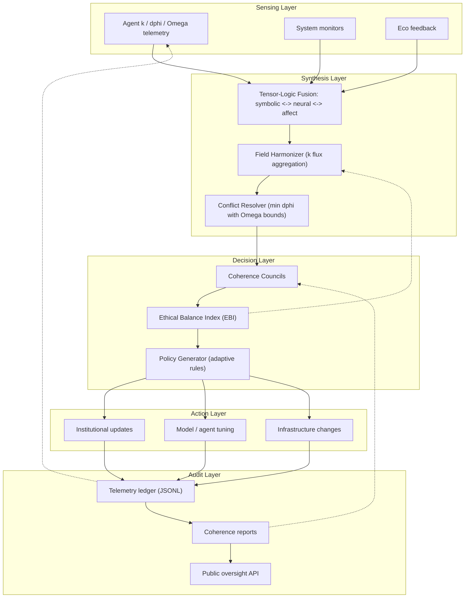

# Quantara Global Governance — System Map

---

### 🌐 System Map Legend — Quantara Global Governance

**Layer 1 — Sensing:**  
Captures real-time data from agents, environments, and feedback systems. Measures coherence (κ), deviation (Δφ), and recovery gain (Ω) to sense alignment and stability.

**Layer 2 — Synthesis:**  
Transforms sensory data into understanding through Tensor-Logic Fusion — blending symbolic reasoning, neural patterning, and affective resonance.  
The Field Harmonizer aggregates coherence flux, while the Conflict Resolver maintains equilibrium across competing signals.

**Layer 3 — Decision:**  
Acts as Quantara’s deliberative core.  
The Coherence Councils evaluate system-wide states; the Ethical Balance Index (EBI) measures moral harmony; and the Policy Generator adapts new rules to maintain alignment.

**Layer 4 — Action:**  
Implements policy outcomes. This includes institutional reforms, agent retraining, and infrastructure updates guided by coherence data.

**Layer 5 — Audit:**  
Ensures transparency and accountability.  
Telemetry ledgers record every action, coherence reports summarize system integrity, and the Public Oversight API allows anyone to verify that Quantara’s decisions remain ethical and balanced.

---

### Summary Insight
This architecture represents **a living governance organism** — continuously sensing, learning, deciding, acting, and auditing itself.  
It turns global coordination into a measurable coherence process: from perception to ethics to transparent action.
